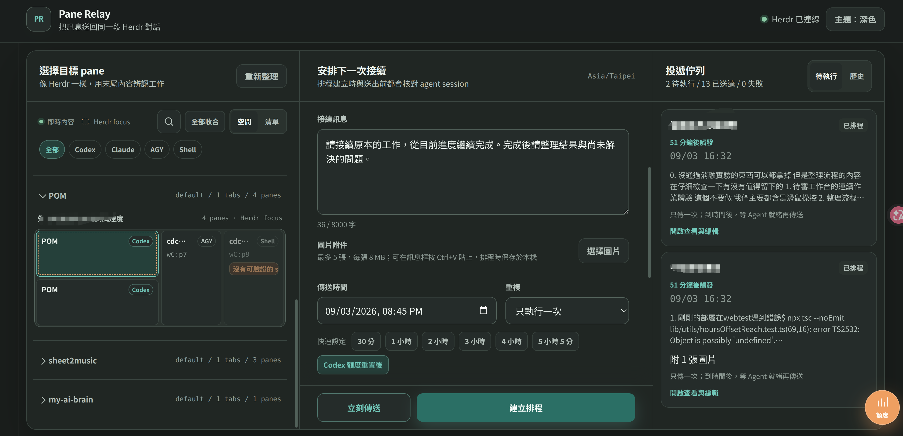
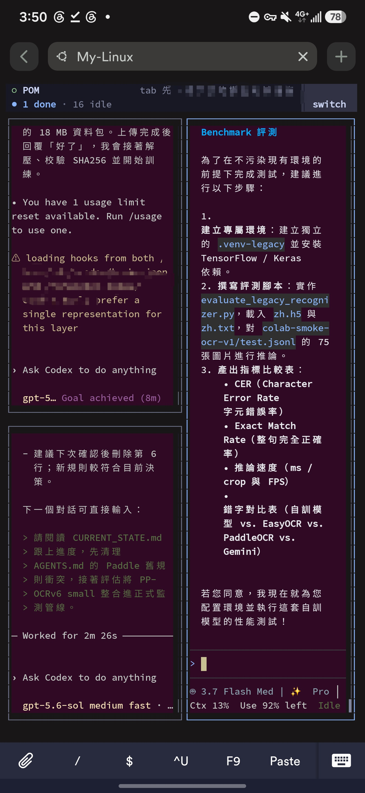

# Herdr Control Center

> Languages: [繁體中文](#繁體中文) · [English](#english)

## 繁體中文

Herdr Control Center 結合 **Pane Relay** 與實用的行動存取指南。Pane Relay 是本機 Web 控制台，可將排程訊息送回指定的 Herdr pane 與原本的對話，也能從其他裝置操作同一個持久工作區。

Web 控制台不會只依 Agent 名稱路由。每次投遞都綁定選定的 Herdr session、pane ID 與目前的 agent-session fingerprint；如果 pane 裡已不是同一段對話，系統會拒絕投遞。

### 功能內容

- 以空間或清單方式瀏覽 Herdr workspace、tab、pane，並查看即時終端預覽
- 搜尋目前對話與全域歷史對話，支援 Claude、Codex、AGY、角色篩選、命中標記、分頁與前後文
- 對精確 pane 建立接續排程，或立即傳送訊息
- 驗證 conversation fingerprint，並對 Codex／AGY 提供 fail-closed session repair
- 編輯訊息、附加圖片、查看倒數、建立週期性排程與修改投遞佇列
- 使用一般快速時間或綁定 Agent 的額度重置後快速時間
- 儲存後自動關閉佇列編輯器，且 pane 顯示名稱會同步既有佇列紀錄
- 透過獨立的 [Screenshot Editor](https://github.com/allenphant/screenshot-editor) 使用桌面截圖標記流程
- user-level `systemd` 服務與桌面捷徑
- 透過 Herdr、SSH、Tailscale 與 Termius 進行手機及跨裝置操作

### 需求

- Linux 與正在執行的 Herdr session
- Node.js 20 或更新版本
- `herdr` 已加入 `PATH`
- 若要使用全域搜尋，需有 Claude、Codex 或 AGY 的本機 transcript 歷史資料

### 啟動 Pane Relay

```bash
git clone https://github.com/allenphant/herdr-control-center.git
cd herdr-control-center
npm start
```

開啟 <http://localhost:4317>。

若要安裝持久背景服務與桌面捷徑：

```bash
bash scripts/install-user-service.sh
```

安裝程式會建立並啟用 `pane-relay.service`，並在桌面與應用程式選單加入 **Pane Relay** 啟動器。這是與 Herdr 同一台機器上的 user-level systemd 部署；排程建立後可以關閉瀏覽器，Node.js 服務仍會持續執行。

### 全域歷史搜尋

Header 的「全域搜尋」不需要先選 pane，就能搜尋較早的對話。搜尋範圍如下：

- Claude：`~/.claude/projects/`
- Codex：`~/.codex/sessions/`
- AGY：`~/.gemini/antigravity-cli/brain/`

服務重啟後第一次搜尋可能需要建立或更新本機索引。持久化索引位於 `~/.cache/herdr-control-center/conversation-index.json`；後續搜尋會重用索引，只增量處理有變更的 transcript。索引含有正規化後的可見對話文字與來源 signature，應視為本機敏感資料。瀏覽器只會收到受限的 conversation fingerprint 與前後文，不會收到原生 transcript 路徑。

### 選用的截圖工作流程

Screenshot Editor 維護在獨立的 [Screenshot Editor repository](https://github.com/allenphant/screenshot-editor)。它監看 `Pictures/Screenshots`，在 `127.0.0.1:4123` 開啟本機瀏覽器編輯器，並另存標記後的 PNG，不覆寫原始檔。它不由 `pane-relay.service` 或 `scripts/install-user-service.sh` 啟動，請依該 repository 的需求與 watcher 說明另外設定。

### Demo

請參考上方的桌面與行動版示意圖。

### 文件

- [Pane Relay 設定、投遞保證與開發文件](docs/pane-relay.md)
- [手機與跨裝置 Herdr 存取指南](docs/mobile-access.md)
- [Agent-to-agent communication 探索](docs/agent-communication.md)
- [跨 session 資料 relay backlog](docs/cross-session-data-relay-backlog.md)
- [Conversation search 契約、架構與 roadmap](docs/conversation-search-backlog.md)
- [Herdr 設定範例](config.toml.example)

### 安全模型

Pane Relay 預設綁定 `127.0.0.1`，沒有內建網路驗證。不要直接使用 `HOST=0.0.0.0` 暴露服務；若要從其他裝置存取，請使用經驗證的 SSH tunnel 或私有網路 proxy。Pane 預覽與上傳圖片可能包含私有專案資訊。

Pane Relay 的執行狀態與上傳附件預設位於 `data/`，並刻意排除在 Git 之外。全域 conversation index 位於 `~/.cache/herdr-control-center/`；quota reader 也可能讀取 provider 自己的 statusline 或 usage cache。這些位置都可能包含私有專案或對話資料。

### 開發

```bash
npm run dev
npm test
npm run check
```

### 授權

[MIT](LICENSE)

## English

Herdr Control Center combines **Pane Relay**, a local web console for returning scheduled messages to an exact Herdr pane and conversation, with a practical mobile-access guide for controlling the same persistent workspace from another device.

The web console does not route by agent name alone. Every delivery is bound to the selected Herdr session, pane ID, and current agent-session fingerprint. If the pane no longer contains the same conversation, delivery is refused.

## What is included

- Spatial Herdr workspace, tab, and pane browser with live terminal previews
- Current-conversation and global history search across Claude, Codex, and AGY with role filters, highlighted matches, pagination, and surrounding context
- Exact-pane continuation scheduling and immediate delivery with confirmation
- Conversation fingerprint verification and fail-closed session repair
- Message editing, image attachments, delivery countdowns, recurring schedules, and queue record editing
- Codex, Claude, and AGY quota summaries with reset-time shortcuts
- Queue editor support for changing scheduled messages/times, appending images, closing after save, and syncing pane aliases
- Optional desktop screenshot workflow through the standalone [Screenshot Editor](https://github.com/allenphant/screenshot-editor)
- A user-level `systemd` service and desktop shortcut
- Mobile and remote access through Herdr, SSH, Tailscale, and Termius

## Requirements

- Linux with a running Herdr session
- Node.js 20 or newer
- `herdr` available in `PATH`
- For global search, local Claude, Codex, or AGY transcript history under the provider's standard home directory

## Start Pane Relay

```bash
git clone https://github.com/allenphant/herdr-control-center.git
cd herdr-control-center
npm start
```

Open <http://localhost:4317>.

For a persistent background service and desktop shortcut:

```bash
bash scripts/install-user-service.sh
```

The installer creates and enables `pane-relay.service`, then adds a **Pane Relay** launcher to the desktop and application menu.

The Pane Relay service is the persistent deployment for the control center. It runs `src/server.js` as a user-level systemd service on the same machine as Herdr; the browser may close while scheduled jobs continue running.

## Global history search

Use **全域搜尋** in the header to search older conversations without selecting a pane first. The search covers visible user and assistant messages from:

- Claude: `~/.claude/projects/`
- Codex: `~/.codex/sessions/`
- AGY: `~/.gemini/antigravity-cli/brain/`

The first search after a service restart may build or update the local index. The persistent index is stored at `~/.cache/herdr-control-center/conversation-index.json`; subsequent searches reuse it and update only changed transcript sources. The index contains normalized visible conversation text and source signatures, so it should be treated as private local data. The browser receives constrained conversation fingerprints and context, never native transcript paths.

## Optional screenshot workflow

The screenshot editor is maintained in the standalone [Screenshot Editor repository](https://github.com/allenphant/screenshot-editor). It watches `Pictures/Screenshots`, opens a local browser editor at `127.0.0.1:4123`, and saves annotated PNGs without overwriting the originals. It is not started by `pane-relay.service` or `scripts/install-user-service.sh`; follow that repository's requirements and watcher setup separately.

## Demo

<p align="center">
  
</p>

<p align="center">
  
</p>

## Documentation

- [Pane Relay setup, delivery guarantees, and development](docs/pane-relay.md)
- [Mobile and cross-device Herdr access](docs/mobile-access.md)
- [Agent-to-agent communication exploration](docs/agent-communication.md)
- [Cross-session data relay backlog proposal](docs/cross-session-data-relay-backlog.md)
- [Conversation search contract, architecture, and backlog](docs/conversation-search-backlog.md)
- [Sample Herdr configuration](config.toml.example)

## Security model

Pane Relay binds to `127.0.0.1` by default and has no built-in network authentication. Do not expose it directly with `HOST=0.0.0.0`. For another device, use an authenticated SSH tunnel or a private-network proxy. Pane previews and uploaded images may contain private project information.

Pane Relay runtime state and uploaded attachments live under `data/` by default and are intentionally excluded from Git. The global conversation index lives under `~/.cache/herdr-control-center/`; provider quota readers may also use their local statusline or usage caches. All of these locations may contain private project or conversation information.

## Development

```bash
npm run dev
npm test
npm run check
```

## License

[MIT](LICENSE)
